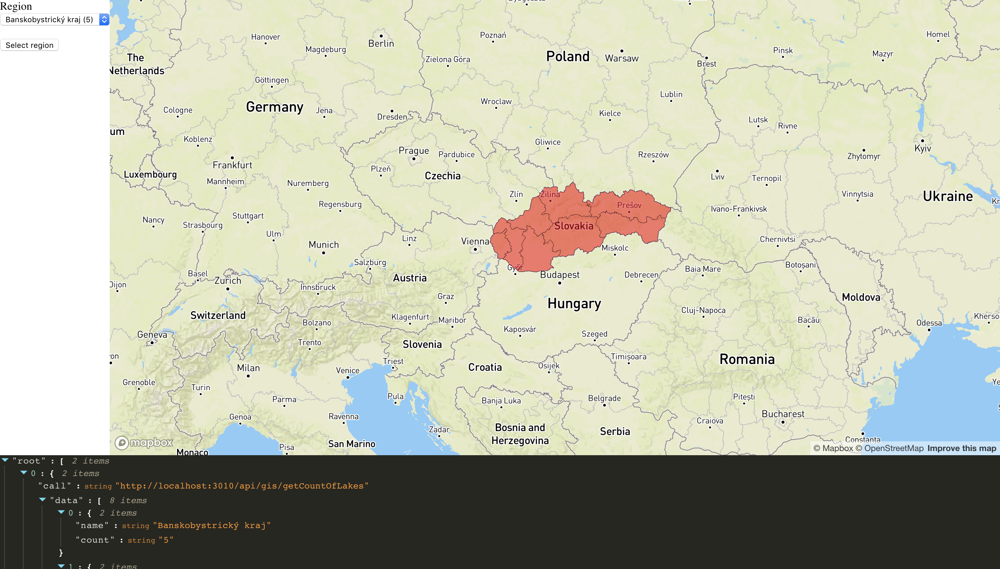
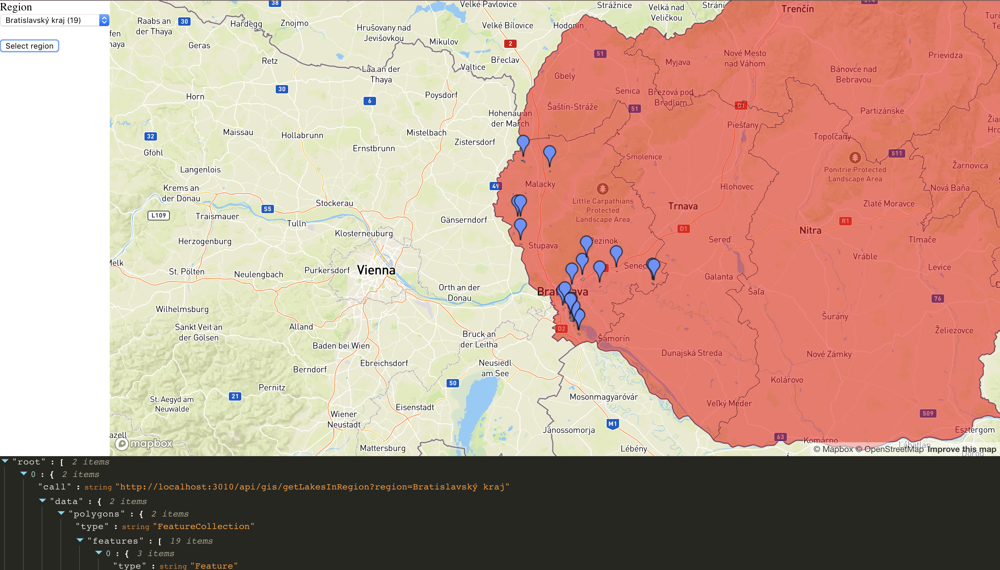

# Overview
Tato aplikacia zobrazuje jazera na Slovensku.
- Zobrazuje iba jazera vacsie ako je priemerna velkost jazier na Slovensku
- Zobrazuje jazera na zaklade krajov, kazdy kraj ma vypisany pocet jazier
- Po kliknuti na marker jazera sa zobrazi detail tohto jazera a 5 najblizsich sluzieb dostupnych pri jazere (obcerstvenie, toalety, atd.) 

# Ukazka aplikacie


Ukazka prvej obrazovky, kde mozeme vidiet 3 hlavne okna. Na lavo je vyber regionov, v strede mozeme vidiet samotnu mapu a naspodku aplikacie sa zobrazuju volane [REST API](#api).


Mozeme vidiet zobrazene jazera z oblasti Bratislavskeho kraja.


Po kliknuti na marker sa nam zobrazi detail spolu s 5 najblizsimi sluzbami.

Aplikacia sa rozdeluje na 2 casti, client - server. Client - [frontend](#frontend) webovej aplikacie vyuziva [mapbox-react-gl](https://github.com/alex3165/react-mapbox-gl) co je nadstavba nad [mapbox](https://www.mapbox.com/) api a [mapbox.js](https://www.mapbox.com/). Server - [backend](#backend) webovej aplikacie je napisane v [node.js](https://nodejs.org/en/) spojeny s postgres databazou s postgis rozsirenim. Client a Server spolu komunikuju pomocou [REST API](#api).

# Client/ Frontend

Frontend aplikacie je single-page application, ktora zobrazuje hlavne mapu a potom bocny panel na filtrovanie jazier. Na stylovanie mapy som pouzil upraveny dark-theme styl, kde som zvyraznil jazera pomocou [mapbox studia](https://www.mapbox.com/mapbox-studio/). Kod pre frontend sa nachadza v zlozke client. Z clientu sa volaju vsetky API pomocou axios.js, ide o dopyty na DB. Vsetky data z DB sa zobrazuju na mape pomocou mapbox-react-gl kniznice.

# Backend / Server

Backend aplikacie je napisany v Node.js, pouzivam express aplikaciu a na vytvaranie dopytov pouzivam knex.js a knex-postgis.js. Backend ma vystavene API na dopyty a predtym ako odosle data na clienta ich upravuje podla potreby.


## Data

Data som stiahol z https://download.geofabrik.de/europe/slovakia.html, ide o data priamo z OSM ale iba pre Slovensko. Dataset mal priblizne ~600 mb po rozbaleni. Data som importoval do Postgres DB pomocou nastroja `osm2pgsql`. Potom som si spojil tabulky point a polygon, kde som transformoval data na suradnicovy system (4326), pre spravne zobrazenie na mape. Tieto transformacie som docielil funkciou `st_transform` a hned som si aj vypocital centroidy pomocou `st_centroid` a ulozil som tieto hodnoty do 2 novych stlpcov geo a centroid, aby sa nemuselo pri kazdom volani pocitat transformacia a pocitanie centroidu. Na konecne GIS data som pouzil este funckiu `st_asgeojson` aby sa mi vratil geojson, ktory sa potom pouziva v mapboxe.

Komunikacia s DB sa nachadza v `server/db` zlozke, kde v subore `db-connection.js` spustim komunikaciu s DB a v subore `queries.js` su napisane queriny pomocou [knex.js](knexjs.org) a knex-postgis.js, co je nadstavba GIS funckii pre knex. Snazil som sa vsetky query postavat pomocou knex ale niektore nefungovali, tak som musel pouzit `knex.raw()` funkciu na priame pisanie query (nasiel som a vytvoril [issue](https://github.com/jfgodoy/knex-postgis/issues/29) s kniznicou, ktoru aj developery zacali riesit). 

Ukazka ako vyzera query dopyt pomocou knex.js a knex-postgis.js:

```
//Knex.js
async getCountOfLakes() {
        let regionQ = knex('polygon')
            .select('geo', 'name', 'osm_id')
            .where({'admin_level': '4'}).toString();
        let lakeSubQ = knex('polygon')
            .avg(st.area('geo'))
            .whereIn('water', ['lake', 'pond', 'lake;pond', 'lagoon'])
            .toString();
        let lakesQ = knex('polygon')
            .select('geo', 'osm_id')
            .whereIn('water', ['lake', 'pond', 'lake;pond', 'lagoon'])
            .andWhere(knex.raw(`st_area(geo) > (${lakeSubQ})`))
            .toString();
        return knex('polygon')
            .with('regions', knex.raw(regionQ))
            .with('lakes', knex.raw(lakesQ))
            .select('regions.name as name')
            .count('*')
            .from('regions')
            .leftJoin('lakes', function () {
                this.on(st.intersects('regions.geo', 'lakes.geo'))
            })
            .groupBy('regions.name');
            
//SQL v postgres
with "regions" as (
	select "geo", "name", "osm_id" 
	from "polygon" 
	where "admin_level" = '4'
	), "lakes" as (
		select "geo", "osm_id" 
		from "polygon" 
		where "water" in ('lake', 'pond', 'lake;pond', 'lagoon') and st_area(geo) > (
			select avg(ST_area("geo")) 
			from "polygon" 
			where "water" in ('lake', 'pond', 'lake;pond', 'lagoon')
		)
	) 
	select "regions"."name" as "name", count(*) 
	from "regions" 
	left join "lakes" on ST_intersects("regions"."geo", "lakes"."geo") 
	group by "regions"."name"
```
## Api

Vsetky API boli vypublikovane pomocou metody GET. Priklad na API

`GET /api/gis/getNearestLakes?pointX=19.6932&pointY=48.6732&region=Banskobystrick%C3%BD%20kraj`

# Databaza/ Postgres

Na vsetky dopyty v databaze som vytvoril indexy (samozrejme iba tie ktore som potreboval), rychlost dopytov sa zrychlila z ~16 sekund na ~500 ms. 

Priklad na vytvorenie indexu
```
CREATE INDEX polygon_region_level ON public.polygon USING btree (admin_level)
CREATE INDEX spatial_polygon ON public.polygon USING gist (geo) //SPATIAL index
```

Taktiez som skusal vytvorit viac stlpcove indexy, ked som pouzival `where {clause} and {clause}` avsak mi to nepomohlo s rychlostou. Tiez som skusal vytvorit `lower` index aby mi DB vedela rychlo spracovavat insensitive case dopyty, avsak aj toto bolo pomalsie ako normalny index. Pri dopytovani krajov som chcel tiez vyuzivat funckiu `unacent`, ale nakoniec som ju nepouzil, nakolko dopyt na kraj bol priamo ten isty aky prisiel z DB, takze nebolo nutne pouzitie tejto funckie.

Zoznam vsetkych GIS funckii, ktore som pouzil pri aplikacii:
- *st_transform()*
- *st_centroid()*
- *st_asgeojson()*
- *st_area()*
- *st_intersects()*
- *st_Distance()*

Celkovo volane dopyty sa nachadzaju v subore `/queries.qsl`.

