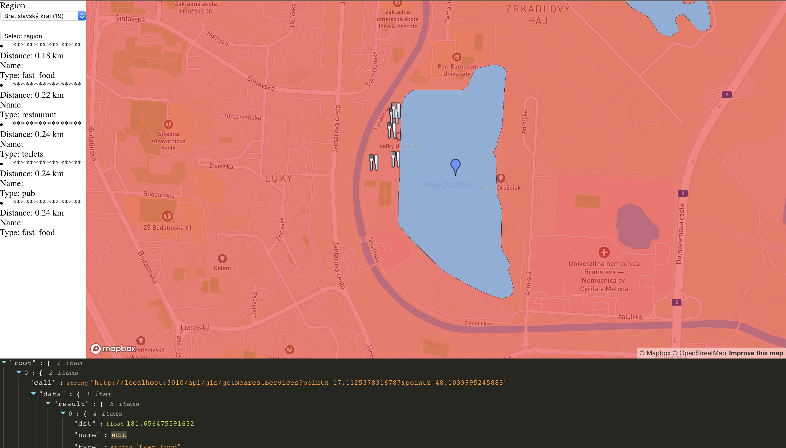

*This is a documentation for a fictional project, just to show you what I expect. Notice a few key properties:*
- *no cover page, really*
- *no copy&pasted assignment text*
- *no code samples*
- *concise, to the point, gets me a quick overview of what was done and how*
- *I don't really care about the document length*
- *I used links where appropriate*

# Overview
Tato aplikacia zobrazuje jazera na Slovensku.
- Zobrazuje iba jazera vacsie ako je priemerna velkost jazier na Slovensku
- Zobrazuje jazera na zaklade krajov, kazdy kraj ma vypisany pocet jazier
- Po kliknuti na marker jazera sa zobrazi detail tohto jazera a 5 najblizsich sluzieb dostupnych pri jazere (obcerstvenie, toalety, atd.) 

# Ukazka aplikacie


Ukazka prvej obrazovky, kde mozeme vidiet 3 hlavne okna. Na lavo je vyber regionov, v strede mozeme vidiet samotnu mapu a naspodku aplikacie sa zobrazuju volane [REST API](#api).


Mozeme vidiet zobrazene jazera z oblasti Bratislavskeho kraja.


Po kliknuti na marker sa nam zobrazi detail spolu s 5 najblizsimi sluzbami.

Aplikacia sa rozdeluje na 2 casti, client - server. Client - [frontend](#frontend) webovej aplikacie vyuziva [mapbox-react-gl](https://github.com/alex3165/react-mapbox-gl) co je nadstavba nad [mapbox](https://www.mapbox.com/) api a [mapbox.js](https://www.mapbox.com/). Server - [backend](#backend) webovej aplikacie je napisane v [node.js](https://nodejs.org/en/) spojeny s postgres databazou s postgis rozsirenim. Client a Server spolu komunikuju pomocou [REST API](#api).

# Client/ Frontend

The frontend application is a static HTML page (`index.html`), which shows a mapbox.js widget. It is displaying hotels, which are mostly in cities, thus the map style is based on the Emerald style. I modified the style to better highlight main sightseeing points, restaurants and bus stops, since they are all important when selecting a hotel. I also highlighted rails tracks to assist in finding a quiet location.

All relevant frontend code is in `application.js` which is referenced from `index.html`. The frontend code is very simple, its only responsibilities are:
- detecting user's location, using the standard [web location API](https://developer.mozilla.org/en-US/docs/Web/API/Geolocation/Using_geolocation)
- displaying the sidebar panel with hotel list and filtering controls, driving the user interaction and calling the appropriate backend APIs
- displaying geo features by overlaying the map with a geojson layer, the geojson is provided directly by backend APIs

# Backend

The backend application is written in Ruby on Rails and is responsible for querying geo data, formatting the geojson and data for the sidebar panel.

## Data

Hotel data is coming directly from Open Street Maps. I downloaded an extent covering whole Slovakia (around 1.2GB) and imported it using the `osm2pgsql` tool into the standard OSM schema in WGS 84 with hstore enabled. To speedup the queries I created an index on geometry column (`way`) in all tables. The application follows standard Rails conventions and all queries are placed in models inside `app/models`, mostly in `app/models/hotel.rb`. GeoJSON is generated by using a standard `st_asgeojson` function, however some postprocessing is necessary (in `app/controllers/search_controller.rb`) in order to merge all hotels into a single geojson.

## Api

**Find hotels in proximity to coordinates**

`GET /search?lat=25346&long=46346123`

**Find hotels by name, sorted by proximity and quality**

`GET /search?name=hviezda&lat=25346&long=46346123`

### Response

API calls return json responses with 2 top-level keys, `hotels` and `geojson`. `hotels` contains an array of hotel data for the sidebar, one entry per matched hotel. Hotel attributes are (mostly self-evident):
```
{
  "name": "Modra hviezda",
  "style": "modern", # cuisine style
  "stars": 3,
  "address": "Panska 31"
  "image_url": "/assets/hotels/652.png"
}
```
`geojson` contains a geojson with locations of all matched hotels and style definitions.
